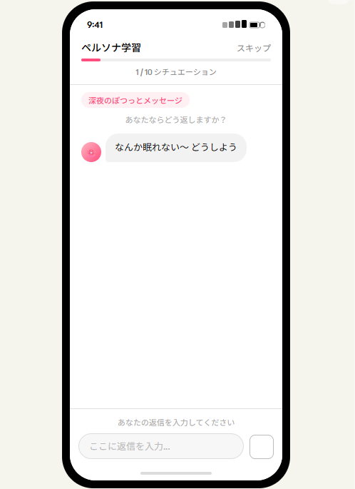
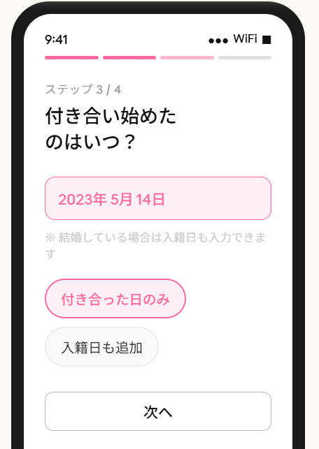
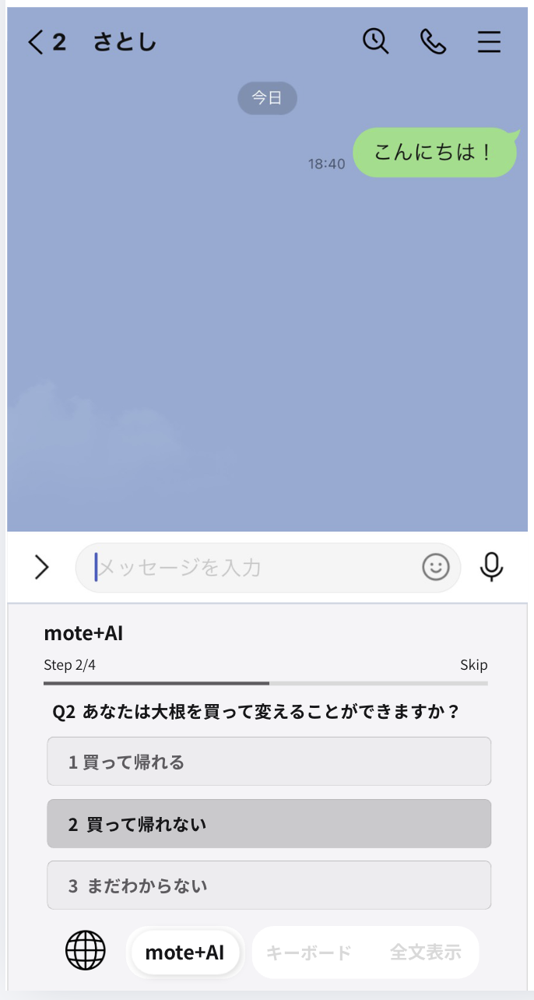
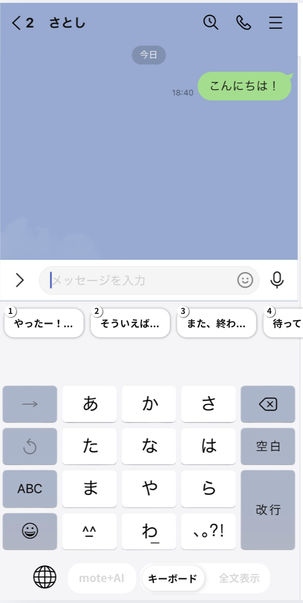
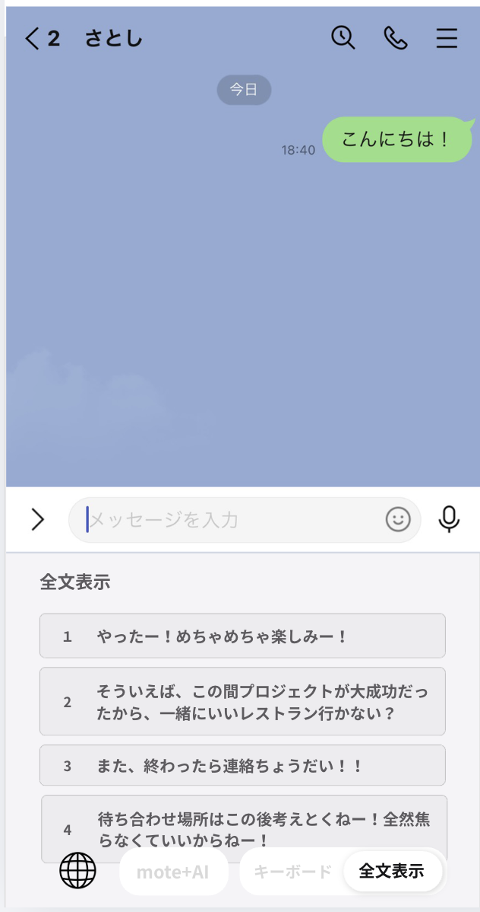

# 要件定義書

> 補足: S-002「テキストハビットチェック」と S-003「リレーションチェック」の参考画像は検討用モックであり、完成UIではない。画像より本文の文言仕様を正とする。

## 1. プロジェクト概要

### 1.1 プロジェクト名

モテキー

### 1.2 目的・背景

目的: 不用意な発言やケアのなさで日々パートナーを傷つけてしまう男性（弱者男性）を救い、最終的に「全女の子（女子）を幸せにする」こと。
背景: 現代は即時性の高いコミュニケーションツール（LINE等）が普及したため、ちょっとした言葉足らずで齟齬が生じやすくなっている。男性は常日頃から細やかな気遣いを考えられるほど賢くなく、相手からの連絡に対して「了解」「OK」といった当事者意識のない返信をしてしまいがちである。すべての会話は「リスク」であるという前提に立ち、AIを活用して2人の関係性を維持・向上させるコミュニケーションをサポートする必要がある。

### 1.3 対象ユーザー

パートナー（彼女や妻）がいる男性。特に、LINEのコミュニケーションにおいて配慮が足りず、無自覚に相手を怒らせてしまう若者〜社会人層

### 1.4 スコープ

- **対象範囲:** 相手からLINE等でメッセージが来た際の、最適な返信文の考案および自動生成（相手からのメッセージに対する「返信」フォーカス）。ハッカソン用のMVP（Minimum Viable Product）としての開発範囲
- **対象外:** 自分から話題を切り出す（自分発信の）メッセージ生成機能。写真等のマルチモーダル読み込みによる文脈把握。スタンプへの対応。

---

## 1.5 ユーザージャーニー

1. **アプリを開く** — モテキーアプリを起動する。
2. **テキストハビットチェック** — ユーザーのLINEでの返信における語尾やテキストスタイル（口調・癖）をチェック・登録する。
3. **大切な人とのリレーションチェック** — パートナー（彼女や妻）とのリレーションシップの状態や、最近の出来事・気をつけるべきことなどを簡単に入力してもらう。
4. **キーボードの許可 & 画面収録の開始** — iOSの設定でカスタムキーボード（モテキー）の使用を許可し、コントロールセンターからBroadcast Extension（画面収録）を開始する。以降、画面収録は常時オンとなる。
5. **LINEを開きキーボードを変更** — LINEのトーク画面を開き、入力キーボードをモテキーに切り替える。
6. **画面キャプチャ & 文脈抽出** — キーボード下部の `mote+AI` タブのボタンを押すと、Broadcast Extensionが常時保存している最新1フレーム（画面画像）をApp Group経由で取得し、Gemini Vision APIに送信してチャット履歴（誰の発言か・会話の流れ）を構造的に抽出する。
7. **アスクユーザーインプット** — `mote+AI` タブ上で、Gemini AIが返信文生成に不足している情報を選択肢形式の質問（計3問）でユーザーに尋ねる。3問すべての質問と選択肢はGemini APIへの1回の呼び出しで一括生成され、回答による分岐はない。各問いの選択肢は3つとする。
8. **メッセージ生成** — Gemini Vision APIで抽出したチャット文脈、アスクユーザーインプットの回答、テキストハビット、リレーションチェックの情報をすべて踏まえ、Gemini AIが適切な返信メッセージを**複数のチップ候補**として提案する。
9. **ステージで確認・編集** — `キーボード` タブでは、予測変換エリアの上に設けた「ステージバー」に生成結果がチップ形式で表示される。ユーザーはチップをタップした順でLINEの入力欄に候補文を反映し、必要に応じて送信前に手編集する。
10. **送信** — LINEの入力欄に反映されたメッセージを、既存の送信UIから送信する。

---

## 2. 機能要件

### 2.1 機能一覧

| ID    | 機能名                         | 概要                                                                               | 優先度 |
| ----- | ------------------------------ | ---------------------------------------------------------------------------------- | ------ |
| F-001 | 画面コンテキスト取得機能       | Broadcast Extensionの最新フレームをGemini Vision APIで解析しチャット文脈を抽出する | 高     |
| F-002 | アスクユーザーインプット機能   | AIが返信に必要な前提条件をユーザーに質問・選択させる（計3問、各問3択、分岐なし、1回のAPI呼び出しで一括生成） | 高     |
| F-003 | ステージ（自動生成・編集）機能 | 全情報を踏まえAIが返信文を複数生成し、チップ形式で提示し、入力欄への反映と送信前編集を支援する | 高     |
| F-004 | テキストハビット登録機能       | ユーザーのLINE返信における語尾やテキストスタイル（口調・癖）を登録する             | 高     |
| F-005 | リレーション登録機能           | パートナーとのリレーションシップの状態や最近の出来事を登録する                     | 高     |
| F-006 | キーボード許可誘導機能         | iOSのカスタムキーボード使用許可・画面収録の開始をユーザーに案内する                | 高     |

### 2.2 機能詳細

#### F-001: 画面コンテキスト取得機能

- **概要:** `mote+AI` タブのボタン押下時に、LINEのトーク画面を解析してチャット文脈を取得する。
- **前提:** Broadcast Extension（画面収録）が常時オンで稼働しており、最新1フレームをApp Group共有ストレージにJPEG形式で常時上書き保存している。
- **入力:** ユーザーによる `mote+AI` タブのボタン押下
- **処理:**
  1. キーボードExtensionがApp Group共有ストレージから最新1フレーム（ダウンスケール済みJPEG、100-150KB以下）を取得する
  2. 取得したフレーム画像をGemini Vision APIに送信する
  3. Gemini Vision APIがLINEのUI構造を認識し、「相手の発言」「自分の発言」を区別しながらチャット履歴を構造的に抽出する
  4. 送信完了後、フレーム画像データを即座に解放する
- **出力:** 構造化されたチャット文脈データ（話者の区別付き）
- **フォールバック:** フレーム取得失敗またはAPI解析失敗時は、キーボード上にテキスト入力欄を表示し、ユーザーに相手のメッセージを手入力してもらう
- **備考:** 画面文脈抽出にGemini Vision APIを採用した理由は [ADR-001](docs/adr/001-gemini-vision-api.md) を参照

#### F-002: アスクユーザーインプット機能

- **概要:** AIが完璧な文章を作るために不足している前提条件を補うため、短い質問をユーザーに提示する
- **入力:** F-001で取得したチャット文脈
- **処理:** Gemini APIへの**1回の呼び出し**で、計3問×各3択の質問と選択肢をすべて一括生成する。質問間の回答による分岐はなく、3問は固定で順番に表示される。ユーザーの各回答はクライアント側で保持し、最終的に返信文生成時にまとめて送信する
- **出力:** `mote+AI` タブ内に質問テキストと3つの選択肢ボタンを表示する。ユーザーの選択後、追加のAPI呼び出しなく次の質問へ即座に遷移する
- **備考:** ユーザーに一から文字を打たせるのではなく、選択肢をタップさせることでUXを向上させる。1回のAPI呼び出しで完結するため、質問間のネットワーク待機がなくエラーハンドリングもシンプルになる

#### F-003: ステージ（自動生成・編集）機能

- **概要:** 全情報を総合的に踏まえ、Gemini AIが最適な返信文を複数パターン生成し、チップ形式で提示する
- **入力:** F-001でGemini Vision APIから取得したチャット文脈、F-002でのアスクユーザーインプットの回答、F-004で登録済みのテキストハビット、F-005で登録済みのリレーション情報、システムプロンプト
- **処理:** Gemini AIが上記すべての情報を基に、返信メッセージを複数のチップ（短文単位）に分けて生成する
- **出力:** `キーボード` タブでは、予測変換バーの上にある「ステージバー」に生成済みチップを横並びで表示する。ステージバーは横スクロール可能とし、各チップは必要に応じて省略表示する。`全文表示` タブでは同じチップ群の全文を一覧表示する
- **備考:** MVPでは専用のドラッグ並び替えUIは持たない。ユーザーはチップをタップした順でLINEの入力欄に文面を反映し、そのまま入力欄上で手編集して送信する。AI生成結果の確認はアスクユーザーインプット完了後に行う

#### F-004: テキストハビット登録機能

- **概要:** ユーザー固有のLINE返信スタイル（語尾・口調・癖）を登録し、AI生成文に反映させる
- **入力:** 複数のシチュエーションに対してユーザーが入力する返信サンプル（計10件）
- **処理:** 返信サンプルをGemini APIで解析し、語尾・口調・癖を要約したテキストハビット情報としてApp Group共有ストレージに保存し、キーボードExtensionから参照可能にする
- **出力:** 解析済みテキストハビットの保存と登録完了画面の表示
- **備考:** 初回セットアップ時に登録。後からアプリ本体で変更可能とする

#### F-005: リレーション登録機能

- **概要:** パートナー（彼女や妻）とのリレーションシップの状態、関係上の重要日付、最近の出来事や気をつけるべきことを登録する
- **入力:** パートナーの呼び名、関係性（彼女/婚約者/妻等）、付き合い始めた日、入籍日（必要時のみ）、誕生日（任意）、最近の出来事や気をつけるべきこと、同意チェックボックスのタップ
- **処理:** 入力されたリレーション情報をApp Group共有ストレージに保存し、キーボードExtensionから参照可能にする
- **出力:** 登録完了画面の表示
- **同意要件:**
  - リレーション情報の入力フォームの末尾に同意チェックボックスを設ける
  - チェックボックスには「入力した内容およびLINEの会話文脈はAI（Gemini API）に送信されます。相手がこのことを知っていない場合、送信前に共有することを推奨します」等の文言を添える
  - チェックボックスにチェックを入れないと「登録する」ボタンをタップできない（非活性状態）
- **備考:** 初回セットアップ時に登録。後からアプリ本体で変更可能とする

#### F-006: キーボード許可誘導機能

- **概要:** iOSのカスタムキーボード使用許可をユーザーに案内し、設定画面へ誘導する
- **入力:** ユーザーの画面遷移（セットアップフロー内）
- **処理:** キーボードの追加手順を画面上で説明し、iOS設定画面へのディープリンクを提供する
- **出力:** 許可完了後、セットアップ完了画面を表示する
- **備考:** フルアクセスの許可が必要。同時にコントロールセンターからBroadcast Extension（画面収録）の開始も案内する

---

## 3. 非機能要件

### 3.1 パフォーマンス

- レスポンスタイム: 画面フレーム取得・Gemini Vision API解析・AIによる質問・文章生成が各数秒以内で完了すること。
- 同時接続数: ハッカソンでのデモ用途を主とするため、厳密な要件は設けない。

### 3.2 セキュリティ

- 認証方式: アプリの初回起動時に、カスタムキーボードのフルアクセス許可およびBroadcast Extension（画面収録）の開始をユーザーから取得する。
- データ保護: Broadcast Extensionは最新1フレームのみ上書き保存し、Gemini Vision API送信後に即座に破棄する。端末のストレージ圧迫やプライバシーリスクを最小限に抑える。

### 3.3 可用性

- 稼働率目標: デモ実行時に安定して稼働すること。
- バックアップ: 特になし。

### 3.4 メモリ・安定性

- キーボードExtension・Broadcast Upload Extensionともにメモリ上限（約50MB）を超えないこと。
- フレーム画像はGemini Vision APIが認識可能な最小解像度までダウンスケール・JPEG圧縮し、100-150KB以下に収めること。
- フレーム画像は送信後即破棄すること。
- すべてのエラーは最終的に「手入力フォールバック」に収束し、クラッシュを回避すること。
- 詳細な設計は [技術設計書](docs/technical-design.md) を参照。

### 3.5 対応環境

- ブラウザ: 対象外
- デバイス: iOSスマートフォン（カスタムキーボードアプリとしての実装）。

---

## 4. 画面・UI要件

| ID    | 画面名                            | 概要                                                                                                                                                                 |
| ----- | --------------------------------- | -------------------------------------------------------------------------------------------------------------------------------------------------------------------- |
| S-001 | アプリトップ画面                  | アプリ起動時の初期画面。初回セットアップフローへ誘導する。                                                                                                           |
| S-002 | テキストハビットチェック画面      | ユーザーのLINE返信における語尾やテキストスタイル（口調・癖）を登録する。                                                                                             |
| S-003 | リレーションチェック画面          | パートナー（彼女や妻）とのリレーションシップの状態や最近の出来事を入力する。入力フォーム末尾に同意チェックボックスを設け、チェックしないと登録ボタンが非活性となる。 |
| S-004 | キーボード許可 & 画面収録開始画面 | iOSのカスタムキーボード使用許可およびBroadcast Extension（画面収録）の開始をユーザーに案内・取得する。                                                               |
| S-005 | キーボードタブ                    | 通常のフリック入力と予測変換を行う基本タブ。このタブがアクティブ表示のときだけキーボード画面を表示する。AI生成結果がある場合は、予測変換バーの上にステージバーが追加表示される。 |
| S-006 | `mote+AI`（アスクユーザー）タブ   | 下部タブのボタン押下で起動するAI補助タブ。押下時に最新フレームの解析を開始し、その後AIからの質問と3つの選択肢ボタンを表示して計3問の回答を受け付ける。このタブがアクティブ表示なのは、Ask User Input UIが表示されている間のみとし、ユーザーが `キーボード` タブへ切り替えた場合は質問フローを中断してローカル状態を破棄する。 |
| S-007 | ステージ / 全文表示確認状態       | S-006で回答を完了すると遷移するAI提案確認状態。`キーボード` タブではチップをステージバーに表示し、`全文表示` タブでは各チップの全文を一覧表示する。ユーザーはチップをタップした順でLINEの入力欄に文面を反映し、既存の送信UIで送信する。 |

S-002「テキストハビットチェック」および S-003「リレーションチェック」の参考画像は、検討用モックとしてのみ扱う。完成UIは未確定であり、画像との差異がある場合は本書のテキスト仕様を正とする。

### 4.0 ワイヤーフレーム

#### S-002: テキストハビットチェック画面（モック）

- 画面上部に「テキストハビットチェック」タイトルと右上に「スキップ」ボタン
- 進捗表示: `1/10 シチュエーション`（計10シナリオ）
- シナリオカード（例: 「深夜のぼつっとメッセージ」）とシナリオ説明文
- 相手のメッセージをバブル形式で表示（例: 「なんか眠れない〜 どうしよう」）
- 下部に自由テキスト入力欄「ここに返信を入力...」と送信ボタン
- ユーザーが実際に返信を入力することでAIが語尾・口調・癖を学習する

#### S-003: リレーションチェック画面（付き合い日入力ステップ）

- 上部に進捗バー（ステップ 3/4 のピンク線）
- 「ステップ 3/4」ラベルと大見出し「付き合い始めたのはいつ？」
- 日付ピッカー（例: 2023年 5月 14日）
- 選択肢ボタン: 「付き合った日のみ」（選択中はピンク塗り）/ 「入籍日も追加」
- 注記: 「※ 結婚している場合は入籍日も入力できます」
- 下部に「次へ」ボタン

#### S-006: mote+AI タブ（アスクユーザーインプット質問UI）

- LINEトーク画面が上部に透けて見える（相手のメッセージ: 「こんにちは！」）
- キーボード上部に `> メッセージを入力` エリア（既存LINEのUI）
- mote+AI パネル内に以下を表示:
  - 「Step 2/3」進捗ラベル
  - 質問テキスト（例: 「Q2 あなたは大根を買って変えることができますか？」）
  - 番号付きの縦並び選択肢ボタン（例: 「1 買って帰れる」「2 買って帰れない」「3 まだわからない」）
- 下部タブ: **mote+AI**（アクティブ）・キーボード・全文表示
- ユーザーが `キーボード` タブへ切り替えた場合、この質問フローは中断される

#### S-005: キーボードタブ（ステージバーあり状態）

- LINEトーク画面が上部に透けて見える
- キーボード直上にステージバーを表示: 横スクロール可能なチップ列（省略表示）
  - 例: 「やった！...」「そういえば...」「また、終わ...」「持って」
- チップをタップすると、その文面がLINEの入力欄に反映される。複数チップをタップした場合はタップ順で入力欄へ積み上がる
- 通常の日本語フリックキーボード（あかさたな配列）が下部に表示
- 下部タブ: mote+AI・**キーボード**（アクティブ）・全文表示

#### S-007: 全文表示タブ

- LINEトーク画面が上部に透けて見える
- 全文表示パネルに番号付きでチップの全文を縦一覧表示:
  1. 「やった！めちゃめちゃ楽しみー！」
  2. 「そういえば、この都プロジェクトが大成功だったから、一緒にいいレストラン行かない？」
  3. 「終わったら連絡するよ！だい！」
  4. 「待ち合わせ場所はこの後の（後輩を？）！！全然気にならなくていいから〜！」
- 各カードは全文確認用であり、必要に応じてタップで入力欄へ反映できる
- 下部タブ: mote+AI・キーボード・**全文表示**（アクティブ）

---

### 4.1 キーボード内UI構成

- 下部タブは `mote+AI`、`キーボード`、`全文表示` の3つを基本構成とする
- `mote+AI` はアスクユーザーインプット専用のUIであり、このタブのボタン押下を起点に画面文脈抽出と質問フローを開始する
- `キーボード` では通常入力を維持したまま、予測変換バーの上にステージバーを重ねてAI提案を確認できる
- `全文表示` ではステージ上のチップ群を全文で確認し、長いメッセージや複数チップの全体像を把握できる
- `mote+AI` タブが色濃く表示されるのは、Ask User Inputの質問UIが表示されているときのみとする
- `キーボード` タブが色濃く表示されるのは、通常のキーボード画面が表示されているときのみとする
- `全文表示` タブが色濃く表示されるのは、チップ全文一覧が表示されているときのみとする
- `mote+AI` では進行表示を `Step 1/3` 〜 `Step 3/3` の形式で表示し、各ステップで3つの選択肢を提示する
- `mote+AI` の質問フロー中に `キーボード` タブへ切り替えた場合、質問・回答・進行中Taskは破棄して通常キーボードへ戻る
- ステージバーは横スクロール前提とし、`キーボード` タブでは短縮表示、`全文表示` タブでは全文表示を行う
- 画面遷移というより、同一キーボード内のタブ切り替えと表示状態の変化として扱う

---

## 5. データ要件

### 5.1 データモデル

データの永続保存はユーザーのデバイス上で行う。アプリ本体・キーボードExtension・Broadcast Extension間のデータ共有には **App Groups**（`group.com.motekey.shared`）を使用する。なお、返信生成に必要な画面文脈・質問回答・一部設定情報は都度Gemini API / Gemini Vision APIに送信される。

| データ項目           | 保存先                           | 書き込み元          | 読み込み元          | 概要                                                                                           |
| -------------------- | -------------------------------- | ------------------- | ------------------- | ---------------------------------------------------------------------------------------------- |
| テキストハビット情報 | App Group (`UserDefaults`)       | アプリ本体          | キーボードExtension | ユーザーの語尾・口調・テキストスタイルの特徴。オンボーディング時にGemini APIで抽出・保存する   |
| リレーション情報     | App Group (`UserDefaults`)       | アプリ本体          | キーボードExtension | パートナーとの関係性・最近の出来事・気をつけるべきこと                                         |
| 最新画面フレーム     | App Group（ファイル、1枚上書き） | Broadcast Extension | キーボードExtension | 最新1フレームをダウンスケール+JPEG圧縮（100-150KB以下）で上書き保存                            |
| システムプロンプト   | アプリバンドル内（静的ファイル） | —（組み込み済み）   | キーボードExtension | 「犬であれ」「ジェントルであれ」「当事者意識」等、返信生成時の振る舞い原則を定義したプロンプト |

### 5.2 外部連携

Gemini APIを利用する。API呼び出しの詳細フローは [API設計書](docs/api-design.md) を参照。

| API                                | 用途                                                           | 呼び出し元                                          |
| ---------------------------------- | -------------------------------------------------------------- | --------------------------------------------------- |
| Gemini API（テキスト生成）         | テキストハビット抽出、アスクユーザーQ1〜Q3一括生成、返信文生成 | アプリ本体（オンボーディング）/ キーボードExtension |
| Gemini Vision API（画像+テキスト） | LINE画面フレームからチャット文脈を構造的に抽出（話者区別付き） | キーボードExtension                                 |

---

## 6. 制約事項

- 技術的制約: キーボードアプリという限られた画面領域（高さ・幅）内で完結させる必要があるため、複雑なUIや長文入力は避ける。
- メモリ制約: iOSキーボードExtension・Broadcast Extensionのメモリ上限は約50MB。画像処理はデバイス上で行わずGemini Vision APIに委譲する。
- 予算・スケジュール: ハッカソン内の限られた時間（MVPとして数時間での構築）で完成させる必要がある。
- その他: ストレージ容量の枯渇による開発環境のクラッシュに注意する

---

## 7. 技術スタック

詳細なアーキテクチャ設計は [アーキテクチャ設計書](docs/architecture.md) を参照。

### 7.1 言語・フレームワーク

| カテゴリ              | 技術                                   | 用途                                                       |
| --------------------- | -------------------------------------- | ---------------------------------------------------------- |
| 言語                  | Swift                                  | アプリ本体・キーボードExtension・Broadcast Extensionすべて |
| UIフレームワーク      | SwiftUI                                | アプリ本体のオンボーディング画面（S-001〜S-004）           |
| キーボードUI          | UIKit (Custom Keyboard Extension)      | azooKeyベースのキーボードUI（S-005〜S-007）                |
| 画面収録              | ReplayKit (Broadcast Upload Extension) | LINE画面を含む全画面フレームのキャプチャ                   |
| Extension間データ共有 | App Groups                             | 3つのExtension間のデータ共有                               |
| データ保存            | UserDefaults (App Group)               | テキストハビット・リレーション情報のローカル保存           |
| ネットワーク通信      | URLSession                             | Gemini APIへのHTTPリクエスト                               |

### 7.2 外部API

| API                    | 用途                                                       |
| ---------------------- | ---------------------------------------------------------- |
| Gemini API（テキスト） | テキストハビット抽出、アスクユーザーQ1〜Q3一括生成、返信文生成 |
| Gemini Vision API      | LINE画面フレームからチャット文脈を構造的に抽出             |

---

## 8. 利用リソース

| リソース名 | URL                                | 用途                                                                                                                          |
| ---------- | ---------------------------------- | ----------------------------------------------------------------------------------------------------------------------------- |
| azooKey    | https://github.com/azooKey/azooKey | オープンソースのiOS向けカスタムキーボードアプリ。ベースとしてフル活用し、モテキー独自の機能（AI連携・ステージUI等）を組み込む |
| Gemini API | https://ai.google.dev/             | Google提供のLLM API。テキスト生成およびVision APIに使用                                                                       |
| ReplayKit  | iOS標準フレームワーク              | Broadcast Upload Extensionによる画面収録に使用                                                                                |

---

## 9. 用語定義

| 用語                     | 定義                                                                                                                                              |
| ------------------------ | ------------------------------------------------------------------------------------------------------------------------------------------------- |
| キーボード               | 通常の文字入力を行う基本UI。一般的なキーボード本体に加え、その上に予測変換バー、さらにその上にステージバーが重なる構成を指す。                    |
| 予測変換バー             | 通常の日本語入力で使う変換候補表示エリア。キーボード本体の直上にあり、そのさらに上にステージバーが表示される。                                    |
| ステージバー             | AIが生成した返信候補チップを横並びで表示するバー。`キーボード` タブ上で予測変換バーのさらに上に表示される。                                       |
| チップ                   | ステージバーに表示されるAI生成メッセージの最小単位。短文単位で区切られ、タップした順でLINEの入力欄に反映できる。`全文表示` タブでは各チップの全文を確認できる。 |
| 全文表示                 | ステージバー上のチップ群を全文で確認するためのタブ。長い候補文や複数チップを一覧で見て、全体の文面を確認する用途を持つ。                          |
| アスクユーザーインプット | AIが返信文生成に必要なコンテキストや前提条件（行く/行かない等）を、ユーザーに短い選択肢で尋ねるUIと対話フロー。計3問で構成し、各問の選択肢は3つとする。3問すべてを1回のAPI呼び出しで一括生成し、回答による分岐はない。 |
| `mote+AI`（もてたい）    | アスクユーザーインプットUIの名称。キーボード下部タブの1つとして表示され、このタブがアクティブなのは質問UIの表示中のみとする。タブ押下を起点に画面文脈抽出、質問生成、回答収集を行う。 |
| ステージ                 | AIが生成したテキスト候補を一時的に保持し、LINE入力欄への反映と送信前編集を支援するための概念全体。MVPでは専用並び替えUIは持たず、主にステージバーと全文表示で構成される。 |

---

## 関連ドキュメント

| ドキュメント         | パス                                                                   | 内容                                                              |
| -------------------- | ---------------------------------------------------------------------- | ----------------------------------------------------------------- |
| アーキテクチャ設計書 | [docs/architecture.md](docs/architecture.md)                           | アプリ構成（3 Extension）、データフロー、技術スタック詳細         |
| 技術設計書           | [docs/technical-design.md](docs/technical-design.md)                   | メモリ設計、画像最適化、クラッシュ対策（3軸別）、コードスニペット |
| API設計書            | [docs/api-design.md](docs/api-design.md)                               | Gemini API呼び出しフロー（初回・毎回）、リクエスト/レスポンス設計 |
| ADR-001              | [docs/adr/001-gemini-vision-api.md](docs/adr/001-gemini-vision-api.md) | Gemini Vision API採用の意思決定記録（Apple Vision OCRとの比較）   |

---

## 更新履歴

| 日付       | 版  | 変更内容                                             | 担当者 |
| ---------- | --- | ---------------------------------------------------- | ------ |
| 2026-03-21 | 1.6 | ステージを「タップ順で入力欄へ反映して送信前編集する」方式に更新し、`mote+AI` のタブ切替中断仕様とワイヤーフレーム表現を整理 |        |
| 2026-03-21 | 1.5 | S-002名称をテキストハビットチェックに統一し、S-002/S-003参考画像がモックである前提と画面仕様の整合を反映 |        |
| 2026-03-21 | 1.4 | アスクユーザーインプットを1回API呼び出しによる3問一括生成・分岐なし方式に変更 |        |
| 2026-03-21 | 1.3 | `mote+AI` タブのUI状態定義を追加し、質問数を3問・各3択に修正 |        |
| 2026-03-21 | 1.2 | `mote+AI` タブ起点の起動フローと4問質問に更新 |        |
| 2026-03-21 | 1.1 | 用語定義、キーボード内UI構成、AI提案確認フローを更新 |        |
| 2026-03-20 | 1.0 | 初版作成                                             |        |
